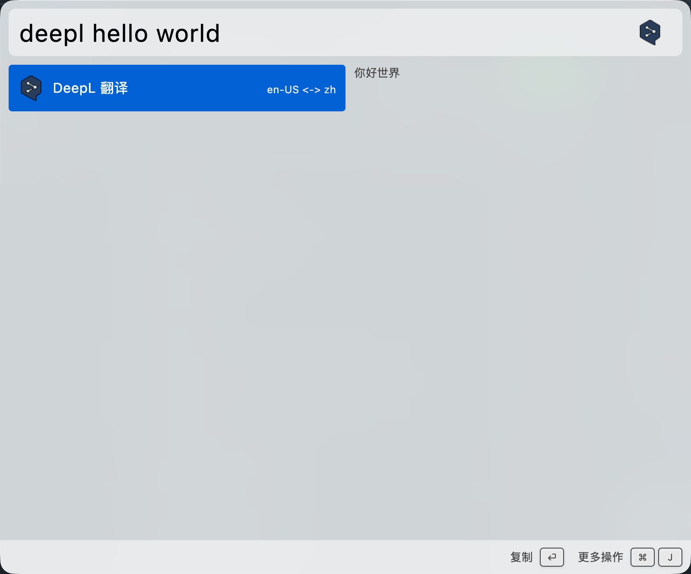

# Wox.Plugin.DeepL

DeepL plugin for Wox

# Install

`wpm install deepl`

# Getting Started

1. Open plugin settings in Wox and set `DeepL API Key`.
2. Configure `Language A` and `Language B` (defaults: `en-US` and `zh`).
3. Input `deepl <text>` and press `Enter` to translate.

Example:

`deepl hello world`

## API key

This plugin requires a DeepL API authentication key.

1. Go to https://www.deepl.com/pro-api
2. Sign up or log in
3. Create an API Free or API Pro subscription
4. Copy your key from the DeepL account API keys page
